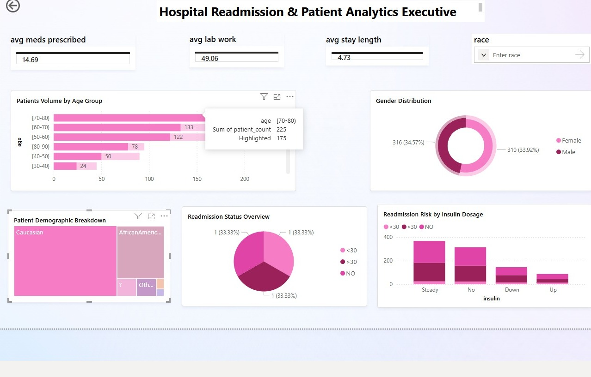

# Hospital-Readmission-Analytics
An executive level dashboard analyzing clinical factors and patient demographics for hospital readmissions

## 🎯 Project Overview
This project features an executive-level Power BI dashboard designed to analyze hospital readmission patterns. The primary goal is to identify clinical and demographic trends that contribute to patient stay duration and medication complexity.

## 📸 Dashboard Preview

---

## 📊 Key Clinical Insights
* **Medication Volume:** Patients average **14.69 medications** per stay.
* **Clinical Intensity:** An average of **49.06 lab procedures** per patient.
* **Efficiency:** The average length of stay is **4.73 days**.
* **High-Risk Demographic:** The **70-80 age bracket** represents the highest patient volume.

---

## 🛠️ Technical Implementation
* **Data Cleaning:** Processed raw clinical data using **Power Query**.
* **Data Modeling:** Established relationships between demographics and readmission status.
* **DAX Measures:** Authored custom formulas for clinical averages.

---

## 📂 Repository Structure
* 📁 **Data/**: Raw CSV files (Demographics, Efficiency, Medication Trends, Readmissions).
* 📄 **Hospital_Executive_Analytics.pbix**: Master Power BI file.
